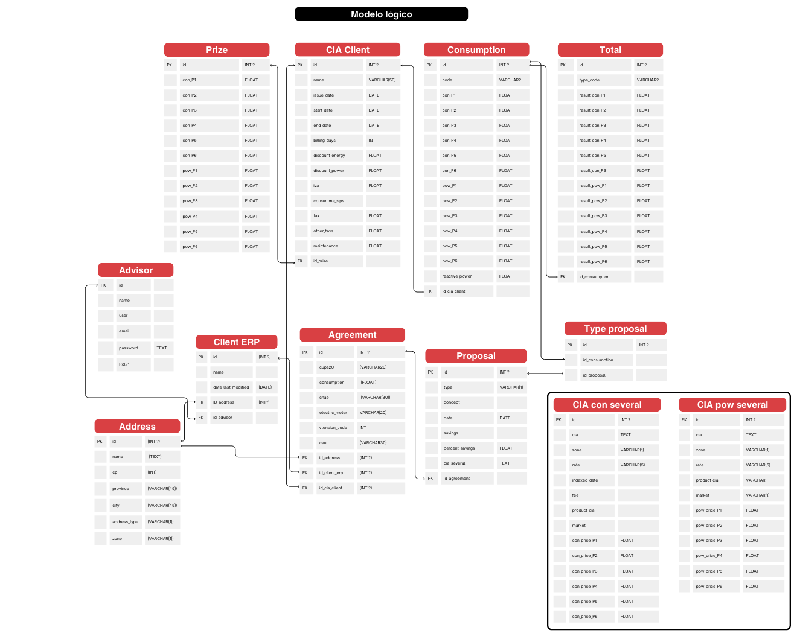
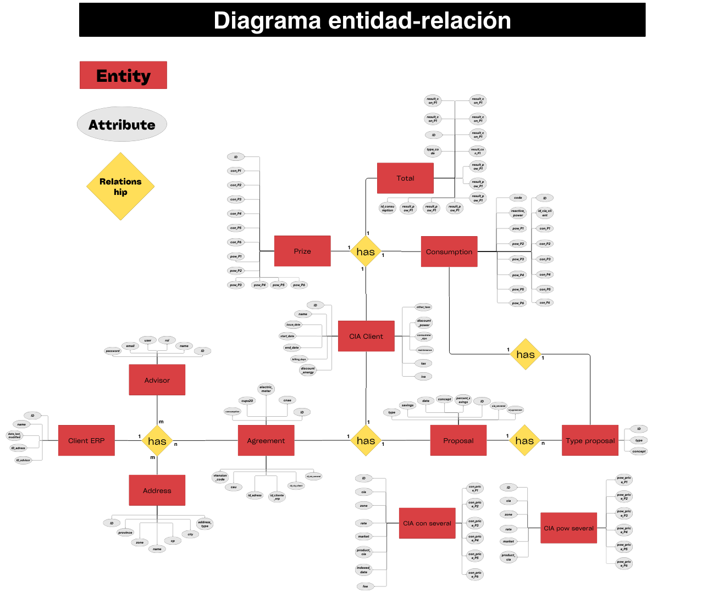
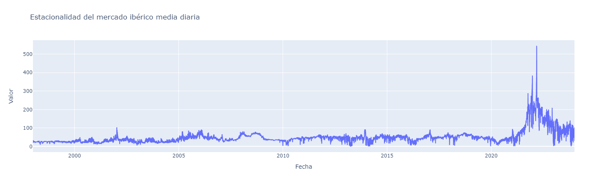
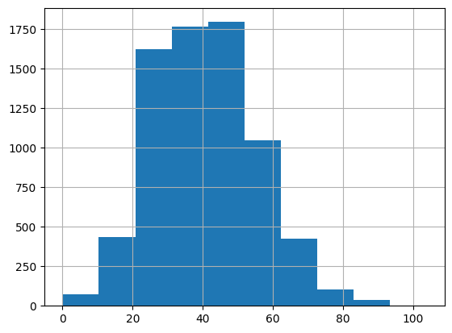
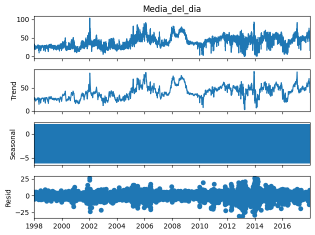
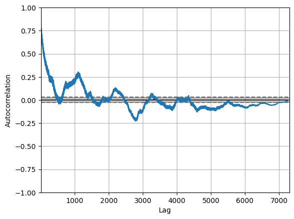

# Memoria técnica Data Science

1. [Introducción](#introducción)
2. [Problemática](#problemática)
3. [Propuesta](#propuesta)
4. [BBDD SQL Relacional (PostgreSQL)](#bbdd-sql-relacional-postgresql)
5. [Automatismos](#automatismos)
   - 5.1 [Web Scraping (Selenium)](#web-scraping-selenium)
   - 5.2 [Tratamiento de imágenes y PDF (OpenCV, PyMuPDF, Regex)](#scrapeo-de-pdf-e-imágenes-opencv-pymupdf-regex)
6. [Modelo de Machine Learning](#modelo-de-machine-learning)
7. [Reporte Analítico](#reporte-analítico)
8. [Librerías](#librerias)

## 1. Introducción
Esta memoria representa el guión principal e hilo conductor del trabajo realizado por los compañeros de Data Science 2309 del grupo 3 del desafío de tripulaciones Javier de Alcazar, Maria Neches, Hugo Martín y Alejandro Campos, siendo tan solo una de las piezas que encajan en la propuesta integrada diseñada para solventar la necesidad y la propuesta realizada por Several Energy, la cual propone una actualización y mejoría de su sistema y flujo internos de trabajo. 

## 2.Análisis detallado del problema.

Se nos presenta la necesidad de crear una WebApp que sustituya, y amplie, las funciones de una tabla de excel.
Las deficiencias de la manera de trabajo actual son varias:

+ Mala escalabilidad. La empresa ha comenzado a tener problemas a la hora de usarla en diferentes situaciones.
+ Poco control del trabajo realizado. Enfarragosa manera de guardar historiales.
+ Exceso de trabajo por parte del asesor a la hora de introducir datos, provocando un largo tiempo de producción en la generación de propuestas.

## 3.Propuesta de solución tecnológica

La tarea de mejorar el trabajo realizado por una hoja excell con una WebApp plantea la oportunidad de usar una BBDD relacional, que acabe con los problemas de escalabilidad y registro de históricos. A ello añadimos la posibilidad de obtener datos de forma automatizada, aliviando la carga de trabajo del asesor.

+ BBDD SQL Relacional (PostgreSQL)
+ Webscrapping (Selenium)
+ Scrapeo de PDF e imágenes (OpenCV, PyMuPDF, Regex)
+ Modelo de predicción 
+ Dashboard (PowerBi)

## 4.BBDD SQL

Una vez analizadas las necesidades de la WebApp para solucionar los problemas actuales, se diseña la BBDD que cumpla las funciones necesarias para el proyecto.
Se trata de una BBDD relacional en PostreSQL 15.0, preparada para alojarse en la nube Azure. Se realizan los planos necesarios para el manejo de la misma un modelo lógico y un diagrama entidad relación conteniendo 12 entidades y 5 relaciones. [Link a la query de creación](/database/sql/create_tables.sql)

### Estructura
Esquema de la BBDD.



[Link para ampliar](https://www.canva.com/design/DAF5e_nv_Bk/PNXGmx8l0Xajcoh2LPONFQ/edit?utm_content=DAF5e_nv_Bk&utm_campaign=designshare&utm_medium=link2&utm_source=sharebutton)

### Relación
Diagrama de relación.



[Link para ampliar](https://www.canva.com/design/DAFy6dl3Pe4/yYekcQiBpDDn7MCyx_-qiw/edit?utm_content=DAFy6dl3Pe4&utm_campaign=designshare&utm_medium=link2&utm_source=sharebutton)

# 5. Automatismos

El flujo del trabajo manual del asesor actual tiene dos tediosas tareas en tiempo que son candidatas a ser sustituidas por automatismos.
Se trata, por un lado,de la obtención de datos desde una intranet a la que se accede vía web, y con un código "CUPs" se extraen datos. Y por otro lado, la lectura personal de facturas para obtener datos de consumo y precios.

#### 5.1WebScraping

Mediante el uso de la librería Selenium, creamos un script que accede a la web de Candela energía para obtener la información necesaria.

[Enlace al script del webscraping](../server/ws-candela/webscraping/ws_app.py)


Esta funcion genera un retorno en formato json con la tarifa y los consumos y potencia anuales a las cuales podemos acceder mediante las credenciales de several energy en la web de candela energía

```bash
    {'rate': '2.0TD',
    'anual_consumption': '2.103 KWh',
    'anual_consumption_p1': '502 KWh',
    'anual_consumption_p2': '472 KWh',
    'anual_consumption_p3': '1129 KWh',
    'anual_consumption_p4': '0 KWh',
    'anual_consumption_p5': '0 KWh',
    'anual_consumption_p6': '0 KWh',
    'anual_power_p1': '4,6',
    'anual_power_p2': '4,6',
    'anual_power_p3': '',
    'anual_power_p4': '',
    'anual_power_p5': '',
    'anual_power_p6': ''}
 ```

 ## Tratamiento de imágenes y PDF

 La extracción y autorellenado de datos se afianzó como parte clave de la mejora en el proceso de creación de propuestas. Tras el estudio con cliente sabemos que las facturas no les llegan todas en el mismo formato y de una manera standar si no que pueden ser desde PDF's hasta capturas de pantalla enviadas por whatsapp o fotos a documentos o pantallas.

Esto nos suponía un reto y la realización de 2 maneras de tratar esto. La idea es que tanto de los PDF's (de manera más sencilla) como en formato imagen JPG o PNG se extraiga todo el texto a texto plano y con regex se extraiga la información de los campos concretos.

Se realizaron un repositorio de diferentes funciones con varias librerias para ver de que manera podíamos extraer mejor los datos. Destacable el uso de la libreria langchain y la API de Open AI para usarlo como intérprete de las facturas, finalmente fue desestimado por que con regex se podría extraer los datos de igual o mejor manera y reduciamos los costes y el tiempo, al evitar una llamada a una API y estar haciendose en "local".

Se idearon 3 scripts para la extración final de estos textos, se puede consultar el código y la documentación en el siguiente [enlace](../server/ws-invoice/functions.py)

1. Conversión de PDF a texto
2. Conversión de Imagen a texto
3. Scrapeo de Texto

## 6. Modelo de Machine Learning

Desde Several Energy se propone la elaboración de un modelo de machine learning para establecer una predicción del precio del mercado de la luz en España. 

Este reto lo afrontamos haciendo primero una búsqueda del histórico de datos del precio de la luz. Finalmente recurrimos a www.omie.es de donde obtenemos un dataset con los precios por hora desde el 01/01/1998 hasta el 31/12/2023 , 25 años de datos listos para ser tratados.

Todo apuntaba a que podíamos enfocar el modelo de machine learning desde el punto de vista de una Serie temporal , empezamos a trababajar los datos para pasar de 24 feateures a 1 para usarla como serie , tratamos diferentes formas estadísticas de establecer esa única variable, viendo la desviación estandar de cada día, la media y precios máximos y minimos. Finalmente decidiamos que la media del precio diario seria la variable elegida para trabajar.




#### Distribución de la serie temporal



#### Gráfico de residuos



#### Gráfico de autocorrelación



#### Resultado de la predicción


## 7. Reporte analítico

La creación de reporte analíco nos llevaba a ofrecer visualizaciones en tiempo real sobre las ventas realizadas y todos los KPIs (Key perfomance indicators) de ventas de los asesores. Nos enfrentabamos a que por razones de seguridad el cliente no podia darnos acceso al ERP para obtener acceso de los datos de ventas por lo que solo podríamos en el mejor de los casos tener datos de la parte previa a la venta, es decir el análisis del cliente, los datos de la factura,la propuesta y del asesor, para poder hacer un dashboard de visualizaciones y demostrar sus funcionalidades hemos creado un dataset falso. 

[Enlace para acceder al dashboard](Notebook/Memoria_Técnica.ipynb)


# 8.Librerías usadas e importaciones


```python
from flask import Flask, request, jsonify
from flask_limiter import Limiter
from flask_cors import CORS, cross_origin
from cerberus import Validator
from werkzeug.serving import make_server

import os
from os import environ
import sys
import signal
import threading
from queue import Queue
import requests
from dotenv import load_dotenv

import cv2 as cv
import easyocr

import psycopg2
from sqlalchemy import create_engine

from selenium import webdriver
from selenium.webdriver.common.by import By
from selenium.webdriver.chrome.options import Options
from selenium.webdriver.chrome.service import Service

import fitz
from langchain.chains import AnalyzeDocumentChain
from langchain.chat_models import ChatOpenAI
from langchain.chains.question_answering import load_qa_chain

from statsmodels.tsa.statespace.sarimax import SARIMAX
from pmdarima.arima import auto_arima, ARIMA

import pandas as pd
import numpy as np
from sklearn.preprocessing import StandardScaler, LabelEncoder
from sklearn.model_selection import train_test_split, GridSearchCV
from sklearn.linear_model import LinearRegression, Ridge, Lasso, ElasticNet
from sklearn.metrics import mean_absolute_error, mean_absolute_percentage_error, mean_squared_error, r2_score
from sklearn.ensemble import RandomForestRegressor, GradientBoostingRegressor
from sklearn.pipeline import Pipeline
from sklearn.decomposition import PCA
from sklearn.tree import DecisionTreeRegressor, plot_tree
from scipy import stats

import matplotlib.pyplot as plt
import seaborn as sns
import plotly.express as px
from IPython.display import IFrame

import streamlit as st
import pandas as pd
import streamlit.components.v1 as c
import requests
import json
from sqlalchemy import create_engine
from dotenv import load_dotenv
import os

```
